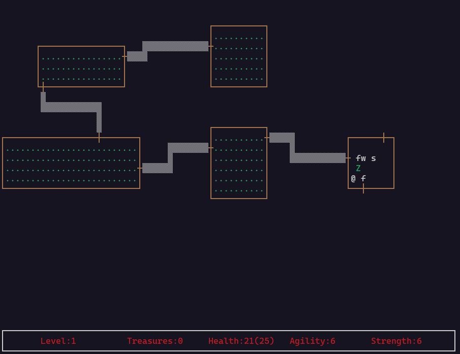

# 🏰 Rogue-like Dungeon Crawler Game
[Anton Evgenev](https://t.me/tdutanton)
*A faithful recreation of the classic 1980 Rogue game with modern Go implementation*

  

  
*Example screenshots*

---

## 🧭 Table of Contents

1. [Requirements](#requirements)
2. [Features](#features)
3. [Gameplay Overview](#gameplay-overview)
   - [Player Stats](#player-stats)
   - [Enemies](#enemies)
   - [Items](#items)
   - [Combat System](#combat-system)
4. [Architecture](#architecture)
5. [Project Structure](#project-structure)
6. [Getting Started](#getting-started)
   - [Prerequisites](#prerequisites)
   - [Build & Run](#build--run)
7. [Controls](#controls)
8. [Save & Load](#save--load)
9. [Author](#author)

---

## 🧰 Requirements

- **Language**: Go (Go 1.22.0 or newer)
- **Library**: [goncurses](https://github.com/rthornton128/goncurses ) – for terminal UI rendering
- **OS Support**: Unix-like systems (Linux/macOS). Windows support may require additional setup.

---

## ⚔️ Features

- 21 procedurally generated dungeon levels.
- 9 interconnected rooms per level.
- Turn-based movement and combat.
- 5 unique enemy types with distinct behavior:
  - Zombie
  - Vampire
  - Ghost
  - Ogre
  - Snake Mage
- Inventory system with food, potions, scrolls, weapons, and treasure.
- Fog of War with visibility based on player position.
- Save/load progress using JSON files.
- Statistics tracking: kills, steps, collected items, etc.
- Leaderboard sorted by treasure collected.

---

## 🎮 Gameplay Overview

### Player Stats

| Stat             | Description                                      |
|------------------|--------------------------------------------------|
| Health           | Current health points                            |
| Max Health       | Maximum possible health                          |
| Agility          | Affects chance to hit and dodge                  |
| Strength         | Determines base damage                           |
| Weapon           | Currently equipped weapon                        |

### Enemies

Each enemy type has unique stats and behaviors:
- **Zombie** – High health, low agility
- **Vampire** – Steals max health, first attack always misses
- **Ghost** – Teleports and becomes invisible
- **Ogre** – Powerful but slow; rests after attacks
- **Snake Mage** – Fast, diagonal movement, can put the player to sleep

### Items

| Type      | Effect                                              |
|-----------|-----------------------------------------------------|
| Food      | Restores health                                     |
| Elixir    | Temporarily increases stat                          |
| Scroll    | Permanently increases stat                          |
| Weapon    | Increases damage                                    |
| Treasure  | Adds score                                          |

### Combat System

- Combat happens when the player moves into an enemy.
- Each attack has 3 stages:
  1. **Hit Check** – Based on attacker's agility vs target's agility
  2. **Damage Calculation** – Based on strength and weapon
  3. **Apply Damage** – Subtract from target's health

---

## 🏗️ Architecture

The game follows a **clean architecture** approach with the following layers:

- **Domain Layer** – Core game logic and entities (characters, enemies, items, dungeon).
- **Application Layer** – Use cases and business rules.
- **Adapters Layer**
  - **Primary (Input)** – Handles user input
  - **Secondary (Render)** – Renders game state using `goncurses`
  - **Storage** – Manages saving/loading game data
- **Services Layer** – Configuration and app-level services

This ensures clear separation of concerns and testability.

---

## 📁 Project Structure
.  
├── cmd/                - Main application entry point  
├── configs/            - Configuration files  
├── internal/  
│   ├── adapters/       - Interface adapters  
│   │   ├── primary/    - Input handling  
│   │   └── secondary/  - Output (rendering) and storage  
│   ├── application/    - Application business rules  
│   ├── domain/         - Core business logic and entities  
│   └── services/       - Infrastructure services  
└── pkg/                - Shared utility packages  

---

---

## ▶️ Getting Started

### Prerequisites

- Go 1.22.0 or newer
- Terminal that supports ANSI escape sequences
- Linux/macOS recommended (Windows WSL works too)

### Build & Run

```bash
make
```

---
## ⌨️ Controls  

Move - WASD

Use Weapon - H

Use Food - J

Use Elixir - K

Use Scroll - E

Select Item / weapon - number keys

---

## 💾 Save & Load  

Progress is saved automatically after each completed level.
Saved data includes:
Player stats
Inventory
Dungeon layout
Enemy positions
Load last session on restart.
All attempts are recorded and shown in the leaderboard.

## 📄 Author
- [Anton Evgenev](https://t.me/tdutanton)
- with [Anna Sorokina](https://t.me/a_a_sorokina)
2025
